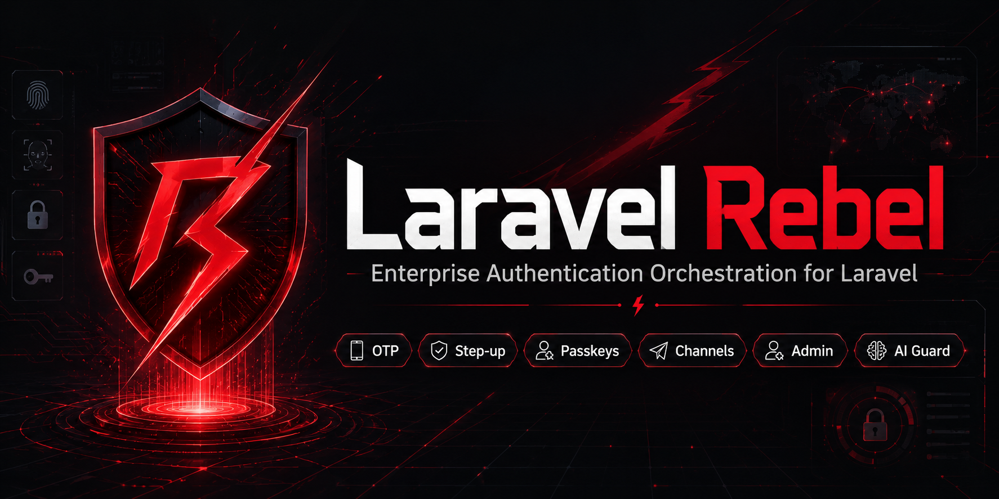

# laravel-rebel-bridge-passkeys



**WebAuthn passkey step-up driver for [Laravel Rebel](https://github.com/padosoft/laravel-rebel-core).**

Bridges `spatie/laravel-passkeys` (or any WebAuthn library you prefer) into Rebel's step-up
`DriverRegistry`, giving you a phishing-resistant **AAL3** step-up factor with one `composer require`
and two lines of configuration.

[](https://github.com/padosoft/laravel-rebel-bridge-passkeys/actions/workflows/ci.yml)
[](https://phpstan.org/)
[](LICENSE)

---

## Glossary

Before diving in, here are the terms you will encounter throughout this README.

| Term | What it means |
|---|---|
| **Passkey** | A cryptographic credential stored in a hardware-backed secure enclave (phone, laptop TPM, YubiKey). You use it with Face ID, fingerprint, or a PIN. No password involved. |
| **WebAuthn / FIDO2** | The W3C + FIDO Alliance standard that defines how browsers talk to authenticators. Passkeys are WebAuthn credentials. |
| **Phishing-resistant** | An assertion is cryptographically bound to the *exact* origin (domain + protocol) of the page that called `navigator.credentials.get()`. A phishing site on a different domain literally cannot capture and replay a valid assertion — the signature simply won't verify. OTP/TOTP/SMS are NOT phishing-resistant. |
| **AAL3** | NIST SP 800-63B Authenticator Assurance Level 3 — the highest tier. Requires a hardware-backed, phishing-resistant factor. Passkeys qualify. |
| **AMR** | Authentication Methods Reference — a list of short strings (e.g. `['webauthn','hwk']`) that describe HOW the user authenticated. Used by compliance and audit systems. |
| **Step-up** | An in-session re-authentication challenge. The user is already logged in; before a sensitive action (e.g. changing payment method, approving a transfer) you ask them to confirm their identity again using a strong factor. |
| **DriverRegistry** | The Rebel step-up registry. Each package contributes its own driver (email-OTP, TOTP, passkey…). The Rebel core selects the right driver for a given purpose/assurance policy. |
| **PasskeyChallenger** | The seam (interface) in this bridge. It decouples the driver logic from any specific WebAuthn library. |

---

## How a passkey step-up works (step by step)

```
Browser                        Your Laravel App                  Secure Enclave / Key
   |                                   |                                  |
   |--- 1. User clicks "Confirm" ----->|                                  |
   |                                   |--- 2. start() ----------------->|
   |                                   |    PasskeyChallenger.startChallenge()
   |                                   |    Generates a fresh random nonce (challenge)
   |<-- 3. WebAuthn options JSON -------|                                  |
   |      (challenge embedded)         |                                  |
   |                                   |                                  |
   |--- 4. navigator.credentials.get() (browser asks OS to sign) ------->|
   |<----- 5. Signed assertion (JSON) ------- (Face ID / fingerprint) ---|
   |                                   |                                  |
   |--- 6. POST assertion JSON -------->|                                  |
   |                                   |--- 7. verify() ---------------->|
   |                                   |    PasskeyChallenger.verifyAssertion()
   |                                   |    - challenge matches nonce from step 2?
   |                                   |    - cryptographic signature valid?
   |                                   |    - origin == registered domain?
   |                                   |    => true or false
   |<-- 8. 200 OK (or 422 Forbidden) --|
```

**Replay protection:** the nonce issued in step 2 is stored as the step-up reference. Even if an
attacker intercepts the signed assertion in step 5, they cannot replay it — `verifyAssertion()` will
reject it because the nonce has already been consumed (or a new nonce will be different).

**Phishing protection:** the browser signs the assertion with the private key only for the exact
origin that issued the challenge. If you host `pay.example.com` and an attacker sets up
`pay-examp1e.com`, the assertion from the real device is cryptographically bound to `pay.example.com`
and will NOT verify on the phishing domain.

---

## Requirements

- PHP `^8.3`
- Laravel `^12` or `^13`
- `padosoft/laravel-rebel-core ^0.1`
- `padosoft/laravel-rebel-step-up ^0.1`
- A `PasskeyChallenger` binding in your container (see [Installation](#installation))

Optional (for the built-in Spatie adapter):
- `spatie/laravel-passkeys ^1.0`

---

## Installation

### 1. Install the bridge

```bash
composer require padosoft/laravel-rebel-bridge-passkeys
```

The package auto-discovers and registers its service provider. No manual registration needed.

### 2. Bind a PasskeyChallenger

The bridge ships with a production adapter for `spatie/laravel-passkeys`. Install it:

```bash
composer require spatie/laravel-passkeys
php artisan vendor:publish --tag="passkeys-migrations"
php artisan migrate
```

Then bind the adapter in your `AppServiceProvider`:

```php
use Padosoft\Rebel\Bridge\Passkeys\Challengers\SpatiePasskeyChallenger;
use Padosoft\Rebel\Bridge\Passkeys\Contracts\PasskeyChallenger;

public function register(): void
{
    $this->app->singleton(PasskeyChallenger::class, SpatiePasskeyChallenger::class);
}
```

### 3. Add HasPasskeys to your User model

```php
use Spatie\LaravelPasskeys\Models\Concerns\HasPasskeys;
use Spatie\LaravelPasskeys\Models\Passkeys\HasPasskeysTrait;

class User extends Authenticatable implements HasPasskeys
{
    use HasPasskeysTrait;

    // ...
}
```

### 4. Publish the config (optional)

```bash
php artisan vendor:publish --tag="rebel-bridge-passkeys-config"
```

---

## Bringing your own WebAuthn library

Not using `spatie/laravel-passkeys`? No problem. Implement the `PasskeyChallenger` interface
against your preferred library (e.g. `web-auth/webauthn-framework`) and bind it:

```php
use App\WebAuthn\MyWebAuthnChallenger;
use Padosoft\Rebel\Bridge\Passkeys\Contracts\PasskeyChallenger;

$this->app->singleton(PasskeyChallenger::class, MyWebAuthnChallenger::class);
```

The interface you need to implement:

```php
interface PasskeyChallenger
{
    // Does this user have at least one passkey registered?
    public function hasPasskey(Authenticatable $user): bool;

    // Issue a fresh single-use challenge. Return an opaque string (the nonce,
    // or serialised WebAuthn options JSON) that you can later pass to verifyAssertion().
    public function startChallenge(Authenticatable $user): string;

    // Verify the assertion (JSON from navigator.credentials.get()) against
    // the challenge issued by startChallenge(). Return true on full success.
    public function verifyAssertion(Authenticatable $user, string $assertion, string $challenge): bool;
}
```

---

## Configuration

`config/rebel-bridge-passkeys.php`:

| Key | Environment variable | Type | Default | Description |
|---|---|---|---|---|
| `drivers.passkeys` | `REBEL_PASSKEYS_DRIVER_PASSKEYS` | `bool` | `true` | Enable the `'passkeys'` step-up driver. The driver is only registered when this is `true` AND a `PasskeyChallenger` is bound in the container. Set to `false` to disable the driver without unbinding the challenger. |

---

## Usage examples

### Example 1 — Protect a route with a passkey step-up

```php
// routes/web.php
Route::post('/account/delete', [AccountController::class, 'destroy'])
    ->middleware(['auth', 'rebel.stepup:delete-account']);
```

```php
// config/rebel-step-up.php
'purposes' => [
    'delete-account' => [
        'required_aal' => 'aal3',
        'require_phishing_resistant' => true,
        'drivers' => ['passkeys'],
    ],
],
```

### Example 2 — Manual step-up in a controller

```php
use Padosoft\Rebel\StepUp\RebelStepUp;
use Padosoft\Rebel\StepUp\StepUpContext;
use Padosoft\Rebel\Core\Context\SecurityContext;

class PaymentController extends Controller
{
    public function confirm(Request $request, RebelStepUp $stepUp): JsonResponse
    {
        $context = new StepUpContext(
            subject: $request->user(),
            purpose: 'confirm-payment',
            security: SecurityContext::fromRequest($request, app(KeyedHasher::class)),
        );

        // Start the step-up: issues a WebAuthn challenge.
        $result = $stepUp->start($context, driver: 'passkeys');

        return response()->json([
            'challenge_reference' => $result->reference,
            'webauthn_options' => $result->options,
        ]);
    }

    public function verify(Request $request, RebelStepUp $stepUp): JsonResponse
    {
        $context = new StepUpContext(
            subject: $request->user(),
            purpose: 'confirm-payment',
            security: SecurityContext::fromRequest($request, app(KeyedHasher::class)),
        );

        $verified = $stepUp->verify(
            $context,
            input: $request->input('assertion'),      // JSON from navigator.credentials.get()
            reference: $request->input('reference'),  // reference from start()
        );

        if (! $verified) {
            return response()->json(['error' => 'Step-up failed'], 422);
        }

        // Proceed with the protected action.
        $this->processPayment($request);

        return response()->json(['status' => 'confirmed']);
    }
}
```

### Example 3 — Check if the driver is available before showing the UI

```php
use Padosoft\Rebel\StepUp\DriverRegistry;
use Padosoft\Rebel\StepUp\StepUpContext;

$driver = app(DriverRegistry::class)->get('passkeys');

if ($driver && $driver->isAvailableFor($context)) {
    // Show the "Use passkey" button.
}
```

### Example 4 — Testing with FakePasskeyChallenger

```php
use Padosoft\Rebel\Bridge\Passkeys\Contracts\PasskeyChallenger;
use Padosoft\Rebel\Bridge\Passkeys\Testing\FakePasskeyChallenger;

// In your test boot or TestCase::defineEnvironment():
$app->singleton(PasskeyChallenger::class, fn () => new FakePasskeyChallenger(
    registered: true,           // user has a passkey
    expectedAssertion: 'valid', // the assertion string that will be accepted
    challenge: 'test-nonce',    // the challenge returned by startChallenge()
));

// All step-up driver logic works offline without any WebAuthn ceremony.
```

---

## Audit events

Every step-up action is recorded to `rebel_auth_events` via the core `AuditLogger`. The following
events are emitted so that the step-up funnel, compliance AMR breakdown, and audit explorer panels
in the Rebel admin all light up:

| Event type | When | `channel` | `amr` | `aal` |
|---|---|---|---|---|
| `stepup.passkeys.started` | A challenge was issued via `start()` | `passkey` | `['webauthn','hwk']` | `aal3` |
| `stepup.passkeys.verified` | Assertion verified successfully | `passkey` | `['webauthn','hwk']` | `aal3` |
| `stepup.passkeys.failed` | Assertion rejected, missing reference, or any exception | `passkey` | `['webauthn','hwk']` | `aal3` |

All events include `subjectType` and `subjectId` (the authenticated user's class and ID). The raw
WebAuthn assertion and credential bytes are **never** included in any audit field.

---

## Competitor card-battle table

How does passkey-based phishing-resistant AAL3 step-up compare to what other platforms offer?

| Feature | Laravel Rebel (this package) | Laravel Fortify (plain) | Shopify | Auth0 | Okta |
|---|---|---|---|---|---|
| Passkey / WebAuthn step-up | ✅ AAL3, phishing-resistant | ❌ No step-up system | ❌ No developer step-up API | ⚠️ Enterprise tier only | ⚠️ Paid addon |
| Phishing-resistant by spec | ✅ Origin-bound by design | ❌ | ❌ | ✅ (if enabled) | ✅ (if enabled) |
| AMR / AAL in audit trail | ✅ `['webauthn','hwk']`, AAL3 | ❌ No standard audit | ❌ | ⚠️ OIDC claims only | ⚠️ OIDC claims only |
| Bring your own WebAuthn lib | ✅ Any library via PasskeyChallenger | ❌ | ❌ | ❌ | ❌ |
| Works without Fortify | ✅ Zero Fortify dependency | N/A | N/A | N/A | N/A |
| Offline tests (no browser) | ✅ FakePasskeyChallenger | ❌ | ❌ | ❌ | ❌ |
| Step-up funnel analytics | ✅ started/verified/failed events | ❌ | ❌ | ⚠️ Paid dashboard | ⚠️ Paid dashboard |
| Open source / MIT | ✅ | ✅ (no step-up) | ❌ Closed SaaS | ❌ Closed SaaS | ❌ Closed SaaS |

---

## Vibe coding with batteries included

This package ships everything an AI agent or a new contributor needs to keep working productively:

- **`CLAUDE.md`** — AI working guide: conventions, security rules, PHPStan recipes, Definition of Done.
- **`AGENTS.md`** — Operational contract: branching, PR flow, guardrails, release checklist.
- **`.claude/skills/rebel-package-dev/SKILL.md`** — Invocable skill for the dev loop (TDD, PHPStan-max
  fixes, telemetry rules).
- **`Testing\FakePasskeyChallenger`** — Deterministic test double: configure accept/reject, which users
  have a passkey, and which challenge is issued. Fully offline — no browser, no WebAuthn API call.

### Dev loop

```bash
composer test       # Pest tests (offline, uses FakePasskeyChallenger)
composer phpstan    # Static analysis, level max
composer pint       # Code style (Laravel preset)
```

### Quick start for contributors

```bash
git clone https://github.com/padosoft/laravel-rebel-bridge-passkeys
cd laravel-rebel-bridge-passkeys
composer install
composer test
```

---

## Package structure

```
src/
  Challengers/
    SpatiePasskeyChallenger.php   # Production adapter for spatie/laravel-passkeys
  Contracts/
    PasskeyChallenger.php         # The seam: swap the WebAuthn library here
  Drivers/
    PasskeysStepUpDriver.php      # Core driver (key:'passkeys', AAL3, phishing-resistant)
  Testing/
    FakePasskeyChallenger.php     # Deterministic test double
  RebelPasskeysBridgeServiceProvider.php
config/
  rebel-bridge-passkeys.php       # drivers.passkeys toggle
tests/
  Feature/
    PasskeysDriverTest.php        # 17 tests covering all paths
```

---

## License

MIT — see [LICENSE](LICENSE).

Part of the [Laravel Rebel](https://github.com/padosoft/laravel-rebel-core) enterprise-auth suite
by [Padosoft](https://www.padosoft.com).
